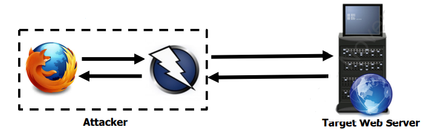
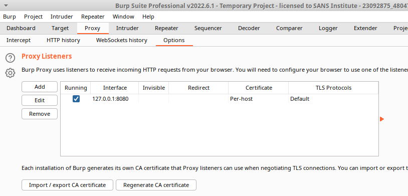
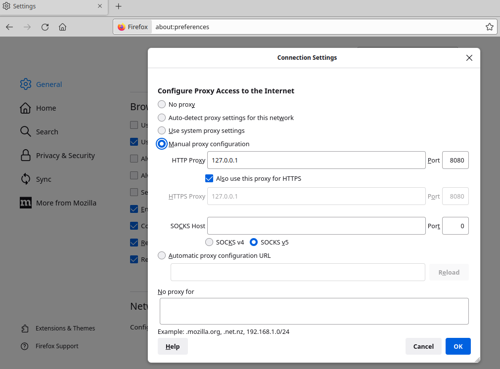
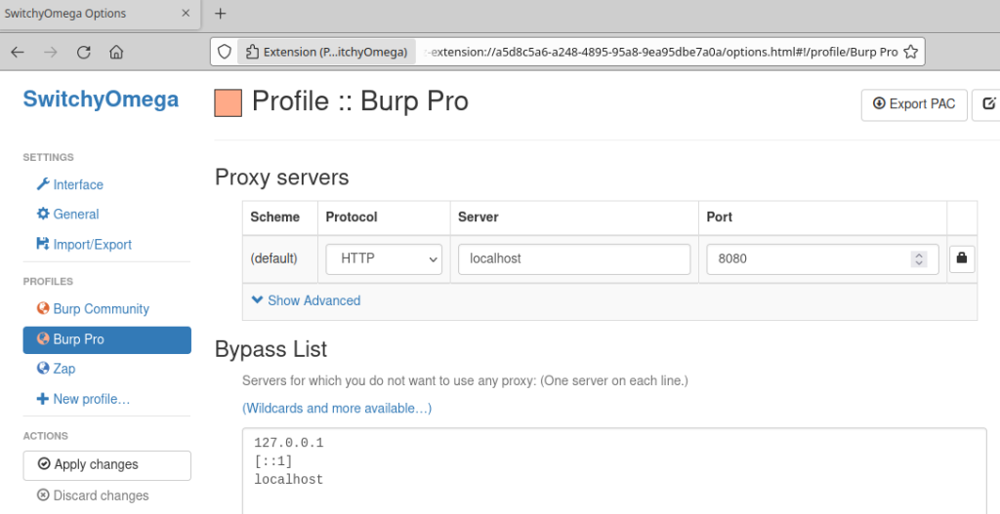
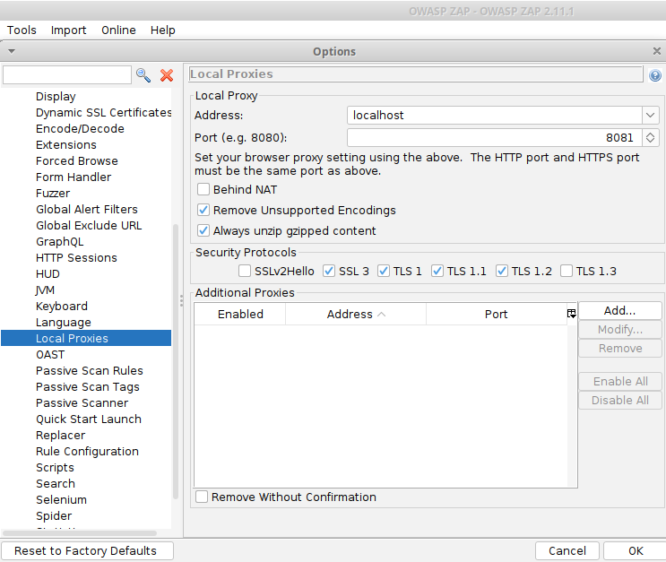

An interception proxy is a must-have tool in any web application penetration tester's arsenal. In brief, an interception proxy is an application downloaded on a host computer and sits in-between a client browser and the remote web server. This specialized tool is purpose-built to intercept HTTP requests that are initiated from the client browser **before** the message is delivered to the remote web server. The tool can manipulate certain elements of the request such as session cookies or parameter values. The application proxy *also* handles the HTTP response **in-reverse**, meaning the tool can examine the raw data contained in the server's response before the content is ultimately rendered by the client browser.

*This diagram illustrates how the ZAP interception proxy is logically positioned "in-between" the client browser (Firefox) and the remote web server.*

Two of the most popular interception proxies are Burp Suite and ZAP. They are published by PortSwigger and OWASP respectively. In this post, I will walk through the process of ensuring that both of these tools are configured correctly before any deep security testing can occur.

Once Burp Suite has been installed, go to the "Proxy" tab, and then the "Options" sub-tab. Add an item to the "Proxy Listeners" table and make sure the "Interface" is set to localhost 127.0.0.1:8080. This IP address specifies to Burp Suite that we want it to listen for any/all traffic occurring on the same client operating system/host computer that is using port number 8080.

Then, we need to make sure that the web browser itself is also configured to send network traffic through the application proxy tool by specifying the same port number. You can configure this manually, (as demonstrated in the screenshot below) by going to the "Settings" tab within Firefox, going to "Network Settings" and then supplying the desired configuration in the "Manual proxy" section.

However, it is much more convenient to utilize a web browser extension like SwitchyOmega or FoxyProxy to handle this manual configuration through the single click of a button (instead of having to navigate to the settings console every time we want to switch between proxying traffic to Burp Suite and using a direct connection to the remote web server).

Proxy extensions expand the default functionality of web browsers. In this case, SwitchyOmega routes traffic requests to Burp Suite using port 8080, instead of making the request to the end-server directly.

The ZAP interception proxy application is published and maintained by OWASP. It has a very similar feature set, however the exact local proxy settings are located in a slightly different area.

Go to Tools > Options > Local Proxies. Then, we see a similar menu as the "Proxy Listeners" tab in Burp Suite. In this case, "localhost" is written in text instead of "127.0.0.1" and we are using port 8081 since 8080 is already being occupied by Burp Suite. Once these settings have been configured in the proxy application as described in this post, we have successfully "man-in-the-middled" the network traffic out-bound from, and in-bound to, the client web browser using either Burp Suite or ZAP.

Now, we are ready to begin testing web applications for OWASP Top 10 vulnerabilities like XSS, CSRF, SQL injection!
