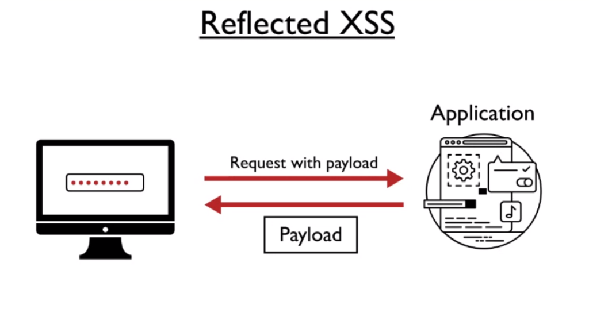
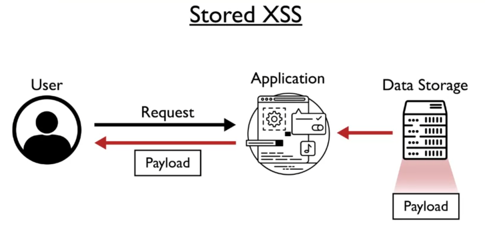

All modern websites consist of at least 3 fundamental components: HTML, CSS, and JavaScript. HTML creates structure, CSS is used for styling, and JavaScript enables interactive user experiences through manipulation of the DOM (Document Object Model). JavaScript however, can also be used by malicious actors to access sensitive information on the client-side. One major category of web application vulnerabilities is known as cross-site scripting (XSS). This vulnerability occurs precisely due to any malicious user's ability to inject JS code into a vulnerable website. If proper security controls are not implemented, this vulnerability makes it possible for an attacker to read and steal an end-user's cookies and session information that otherwise should be private and confidential.

According to the [OWASP Top 10](https://owasp.org/www-project-top-ten/), cross-site scripting (XSS) is one of most pervasive vulnerabilities affecting web applications in 2023. Similar to many other categories of web application vulnerabilities, XSS fundamentally stems from design choices made by website software developers to freely accept processing of user input *without* validation or sanitization checks. If a web application accepts user input (instead of exclusively accepting Javascript that was intended and specified by the website's developer, perhaps by specifying the Content-Security-Policy HTTP header), then various fields and/or URL parameters on that webpage are almost definitely vulnerable to XSS.

**Reflected XSS**

When an input field on a website accepts Javascript in a submission box (such as a search field), the web application passes that code to the backend server in a standard HTTP request, which then renders that payload in the user's browser. This classification of XSS is categorized as "reflected." This makes sense because the web server immediately "reflects" the input Javascript back into the user's browser if the web application conducts no filtering of user input.

For example, if a penetration tester inputs  into a insecure web application's search field, and the client browser immediately returns a dialog box with the content "1", then that web application is definitely vulnerable to reflected XSS.

**Stored XSS**

When a website accepts user input in a long-term data format (such as in blog comments, forum posts, or logging agents) that data/text/code continues to persist in the web application's backend database. This issue is especially problematic if the web application conducts no escaping/filtering of that text, which can permit processing/execution of that input as functional Javascript code in the client's browser.

Since the injected code has now become persistent in the web application (which is different from the reflected case), this classification of XSS is considered "stored." The danger here is that the stored payload will be activated each time the browser loads the webpage, even for new/other users who browse the webpage.

**DOM-based XSS**

There is a 3rd classification of malicious Javascript web application vulnerabilities called DOM-based XSS that requires a subtle, yet important distinction to understand. In both Reflected and Stored XSS, the attacker's payload causes a (temporary or permanent - respectively) change in the HTTP response delivered by the web server to the client's browser. However, in DOM-based XSS the focus lies exclusively on the client side. According to OWASP, the XSS attack payload modifies the client's DOM environment such that the Javascript code runs on the client-side in an unexpected manner.

In the examples I have seen, DOM-based XSS exploitation occurs when an attacker manipulates a URI parameter to create an unexpected or seemingly benign DOM object on the client-side when rendered by the client's browser at runtime. When this tactic is combined with social engineering to get an unknowing user to submit a manipulated URL in their local browser, the attacker may obtain access to the victim's cookies - which then opens the victim up to any number of session hijacking and authentication bypass vulnerabilities.

**Sources** -

<https://owasp.org/www-community/attacks/DOM_Based_XSS>
