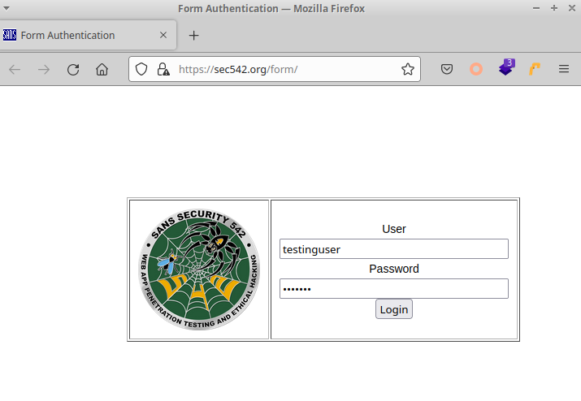
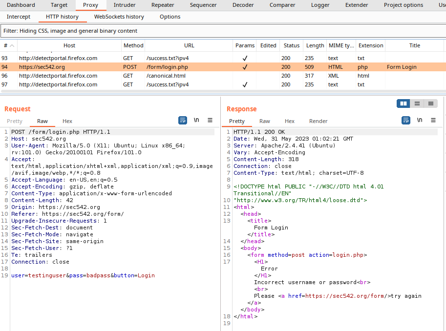
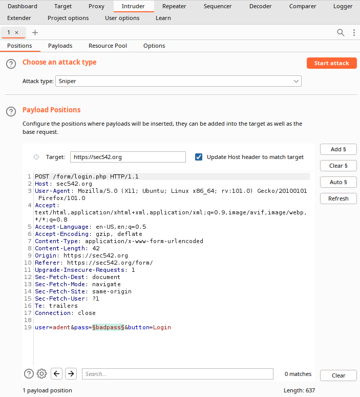
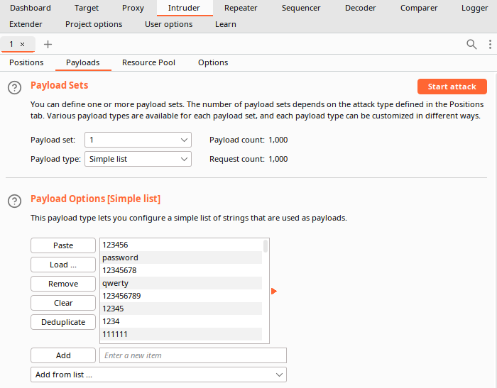
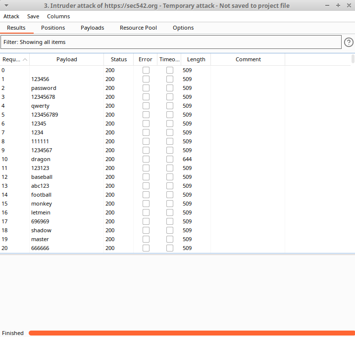
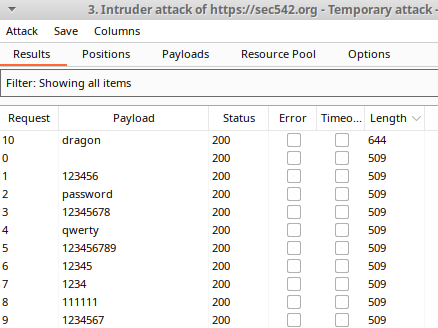
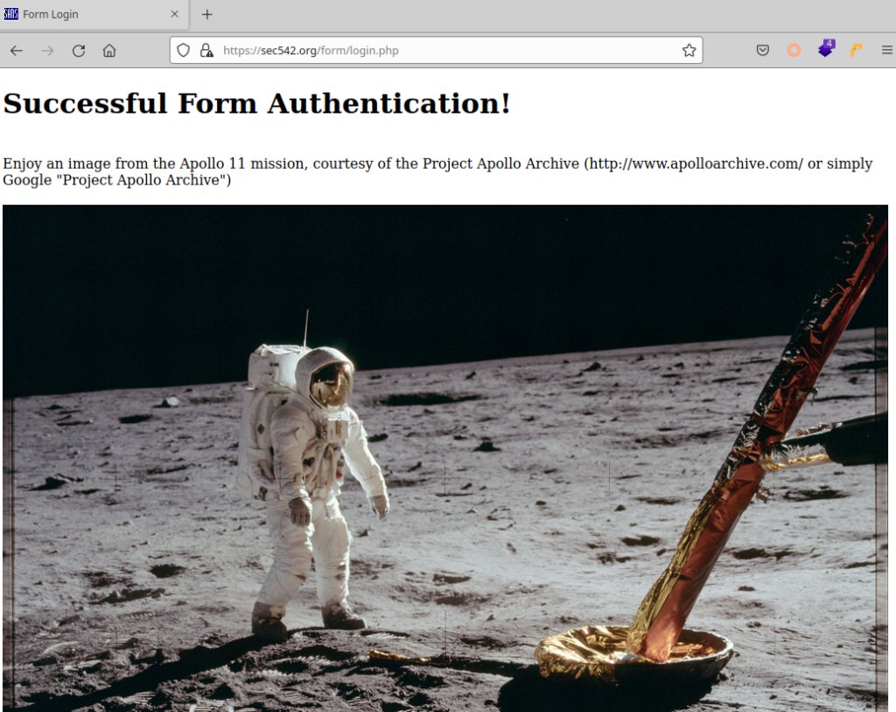

In this lab exploring HTML forms-based authentication, I use Burp Suite to fuzz a username of interest to discover a valid password combination. "Fuzzing" in the context of web application security means any automated attempt to inject a large number variables into any field that accepts user input. The tester then monitors the application for unexpected behavior or unusual results that may indicate the presence of a vulnerability. Possibilities for fuzzing input ranges from common usernames, passwords, URLs, sensitive data patterns, executable shell commands and SQLi payloads. [SecLists is a well-known repository](https://github.com/danielmiessler/SecLists) that maintains wordlists for each of these mentioned categories. The choice of which wordlist to use depends on the context of the input field and what category of vulnerability the tester suspects may exist within the application.

Once Burp has been properly configured to proxy traffic from and back-to Firefox (as I described in the post from last week), we can initiate the process to seed Burp with an HTTP request that can be manipulated. First, turn on the proxy and navigate to the website we are interested in testing. In this example, I will be using a deliberately weak and insecure web login portal that has been set up by the SANS Institute instructors for SEC542 - (https://sec542.org/form/).

In the example above, I input "testinguser" for the username and "badpass" for the password. Then I clicked on the "Login" button, which sends this data to the backend web server in an HTTP request.

Switching over to Burp Suite and navigating to Proxy > HTTP history, we find the username and password was sent as a POST request sending the data in the body field below the header values. Right-clicking on line 94 and selecting "Send to Intruder" readies this HTTP request for fuzzing.

Burp will automatically select several parameter fields that it detects as possible inputs for fuzzing. However, in this lab we are given a specific username to crack which is "adent", so we can clear the selector symbols, and then specify "badpass" as the single payload position to fuzz in the body of the POST request.

Next, we navigate to the "Payloads" tab, and then load a wordlist of the top 1000 most common passwords into Burp. This will fuzz the "pass" parameter in the HTTP request with all of the values contained in the wordlist one-by-one. The username parameter will remain "adent" in each of these fuzzing attempts since only 1 payload position is being specified to Burp.

In less than 10 seconds, Burp quickly returns a table of all 1000 attack results. Clearly, this web login form does not specify a maximum number of login attempts or require a session time-out between failed attempts since Burp was able to fuzz the vulnerable login form to completion. This example demonstrates the value of implementing security control best practices, since a better designed web application would have substantially hindered the hypothetical attacker - although that is a lesson for a different day.

Once the Burp Intruder results have been completed, how can we tell which fuzzed password attempt was the correct combination? Remember, one of the intents behind fuzzing is to elicit behavior from the web application that is unusual or unexpected.

Given that failed login attempts are likely to return exactly the same webpage with a short statement that the credentials were incorrect, it makes sense that the content length of the server's response would be the same size for failed logins. Sorting the table by decreasing length however, reveals one payload that returns a unique response from the server that is significantly larger. This characteristic of increased content length matches a real-world example of a valid login because there is likely to be some type of additional business functionality that a successfully authenticated user would have access to, thereby increasing the size of the webpage returned by the server. Returning to the original login page and manually testing the combination "adent:dragon" in the login form confirms this result.

