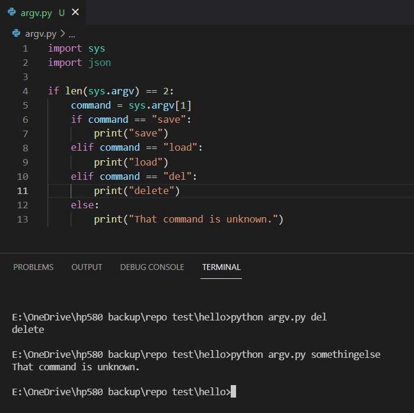

In this writeup, I will cover how a custom script in python “knows” to read text input by the user written at the command line. In line 1, the sys module is first imported. This makes all functions defined within the sys module available to the namespace of the rest of our program.

The dot operator accesses the “argv” property contained within the sys module, and this value is stored in the “message” variable. Then, when we print this variable, python returns a list object with 3 indexes. The string ‘argv.py’ is contained at the [0] index, ‘hello’ at the [1] index, and ‘everyone!’ at the [2] index.

*Running “python argv.py del” in the command line returns the string “delete”. However if “somethingelse” is passed as a command line argument, this program returns, “That command is unknown.” as shown above.*

Here I changed the logic of my program to check if any string argument is passed to the argv.py file in the command line. In line 5, I have to access the 2nd element of the list sys.argv[1] since as mentioned above the [0] index is the name of the program itself. Then I add nested if statements to further check whether the argument passed in the command line matches a particular string that I would like to code additional logic for.

In this sample script, the output action is simply to print the same string if there is a match with “save”, “load” or “del” — but any additional logic that could be defined to interact or retrieve data from the system is, of course, also possible. Thank you for reading this explanation!
