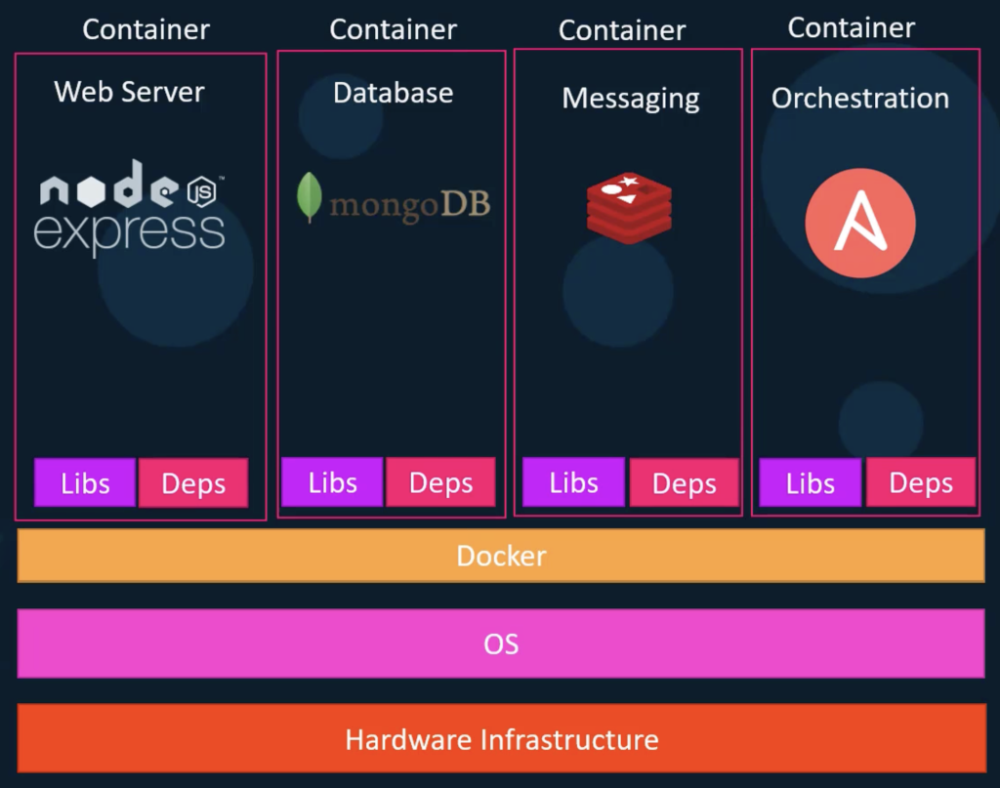

Docker is a useful tool that permits developers to build interoperable applications using isolated environments.

Using this illustration as an example, the Node.js web server, MongoDB database, Redis messaging, and Ansible orchestration applications each can co-exist on the **same** virtual machine in the cloud (or on a developer's local machine) hardware infrastructure without interfering with each other.

In addition to interoperability, Docker containers are also helpful because they better utilize limited and expensive compute resources.
