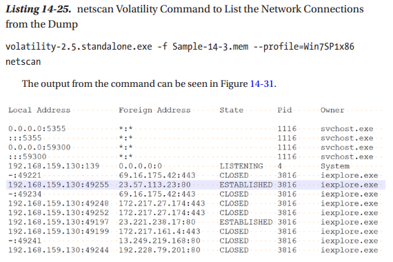

In the world of digital forensics, we can envision data as belonging to two distinct categories. Those categories are either volatile, or non-volatile states of data (Mohanta, 2020). Volatile data includes random-access memory (RAM) that depends on a running power supply, whereas read-only memory (ROM) or data that is written to a hard disk is considered non-volatile. The readable contents of non-volatile data do not change upon power interruption. The industry standard open source tool I will explore this week to conduct memory forensics on traditional desktop endpoints has aptly been named Volatility.

Analysis of volatile memory helps to corroborate a unifying story regarding what processes and applications were forensically determined to be running at the time of image collection. This high-quality information often incudes data about active processes, executed applications, established network connections, registry hives, and web page artifacts (Scaldaferri, 2022). Two particularly helpful commands included within Volatility are "apihooks" and "netscan." According to Cynet.com, Windows API hooking makes operating system services (like filesystem, processes, threads, networking) available to software applications that request these OS services. Unfortunately, malware applications also leverage the same WinAPI implementation to extend functionality for malicious functions (instead of legitimate purposes like debugging. (Grinberg, 2022).

Last, I have included an example screenshot of the netscan command used within Volatility (Mohanta, 2020). The command-line output yields substantial evidentiary information from the archived memory image. This evidence includes foreign IP addresses the host computer has visited, which TCP connections were established, and what process/PID/application was associated with that IP address (at the time of memory collection).

References -   
Grinberg, S. (2022, February 1). API Hooking - Tales from a Hacker’s Hook Book. Cynet. https://www.cynet.com/attack-techniques-hands-on/api-hooking/  
Mohanta, A., & Saldanha, A. (2020). Memory Forensics with Volatility. In Malware Analysis and Detection Engineering (pp. 433-476). Apress, Berkeley, CA. https://link.springer.com/chapter/10.1007/978-1-4842-6193-4\_14  
Scaldaferri, G. (2022). Memory and Mobile Device Forensics (Week 5 Powerpoint). University of Maryland, Baltimore County.
