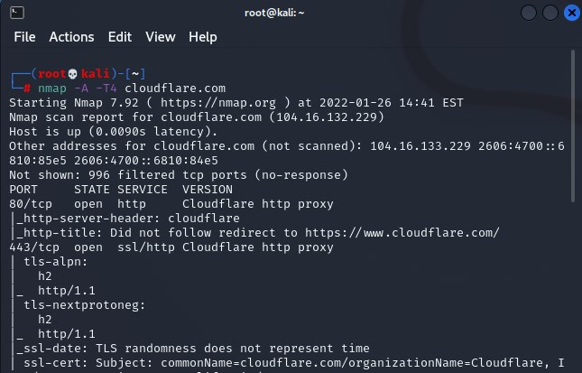
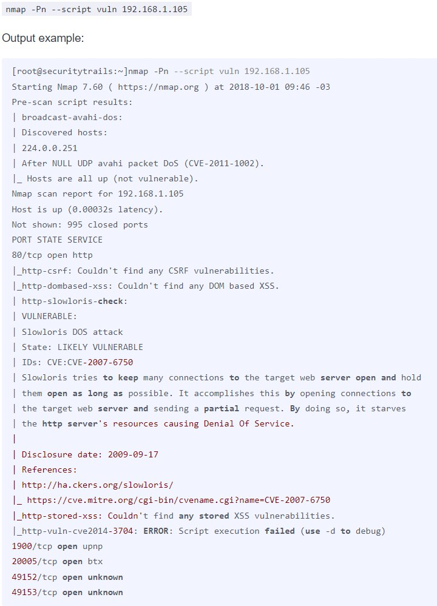

Nmap is an extremely powerful, free and open-source network mapping utility that can be used for many purposes. In this post, I provide a brief overview of what Nmap can be used for in the cybersecurity industry. These various and useful functions include determining what hosts exist on a network, what services those hosts may offer, and what operating systems (and OS versions) may be running on the backend. Nmap can also scan information about firewalls and potentially also how to evade them. All of this information is acquired across whichever devices respond in the scanned range of IP addresses.

Nmap determines this information by sending raw IP packets to targets in the specified range. Then by analyzing data in the response packet, identifying information can be determined about the remote machine. Nmap can scan against a single target host IP address, but this tool can also scan entire enterprise-scale environments for assets and possible vulnerable services as well.

*The command `nmap -A -T4 cloudflare.com` was input into an administrative Kali terminal. The `-A` flag enables OS detection, version detection, default script scanning, and traceroute. `-T4` is a timing template that specifies the interval between sending packets and waiting for the response.*

Although the amount of text output initially feels overwhelming, it helps to break down each of the sections into different parts. There are 4 columns indicating the **Port**, **State**, **Service**, and **Version**. This information is valuable because it tells us not only whether a particular service is open and listening (the http service is open on port 80/tcp in this example); it also tells us detailed information about the version of the service (Cloudflare, Apache, Nginx, Windows IIS, etc.) that is running on that device. We can take this information to consult with other sources. This cross-referencing process will determine whether any vulnerabilities and/or exploits already exist in the wild for that specific CVE on the public internet.

The state of a port scanned by Nmap can be either open, filtered, closed, or unfiltered. **Open** means there exists an application on the target machine that is actively listening for connections/packets on that port. **Filtered** means that a firewall, filter, or some other network obstacle is blocking that port, so Nmap cannot determine its state. **Closed** ports do not have any application listening at that location. **Unfiltered** ports do send a response in some manner to Nmap's probes, but not according to the expected pre-determined categories.

*In this example `nmap -Pn --script vuln 192.168.1.105` was executed. This NSE script detected CVE-2007-6750 named "Slowloris DoS attack" as a vulnerability on the scanned http server.*

Finally, the NSE (Nmap Scripting Engine) is another useful feature contained within the Nmap utility. This feature allows security administrators to run scripts that automatically test whether devices on their network are vulnerable to certain well-documented CVEs. From the vulnerability test in the above example, researchers were able to detect a specific CVE that attackers could leverage to launch a Denial of Service (DoS) attack on this http server. In other circumstances, different types of vulnerabilities may result in a more severe incidents such as intellectual property theft or a customer information data breach storing names, credit card numbers, and home addresses.

References -

“Nmap Reference Guide.” *Chapter 15. Nmap Reference Guide | Nmap Network Scanning*, https://nmap.org/book/man.html.

*Top 16 Nmap Commands: Nmap Port Scan Tutorial Guide*. https://securitytrails.com/blog/nmap-commands.
