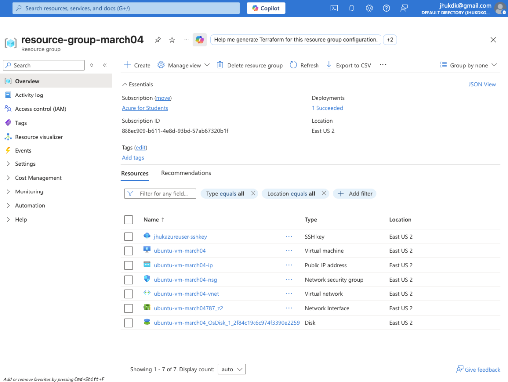
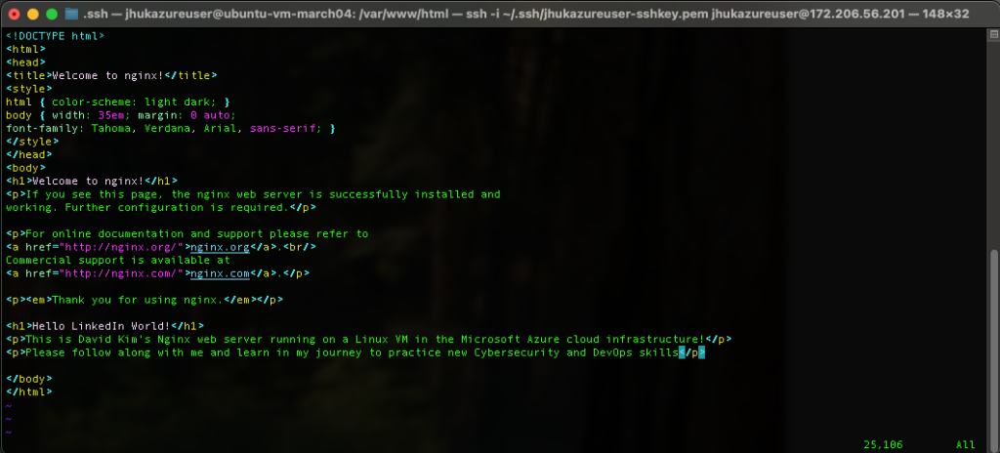
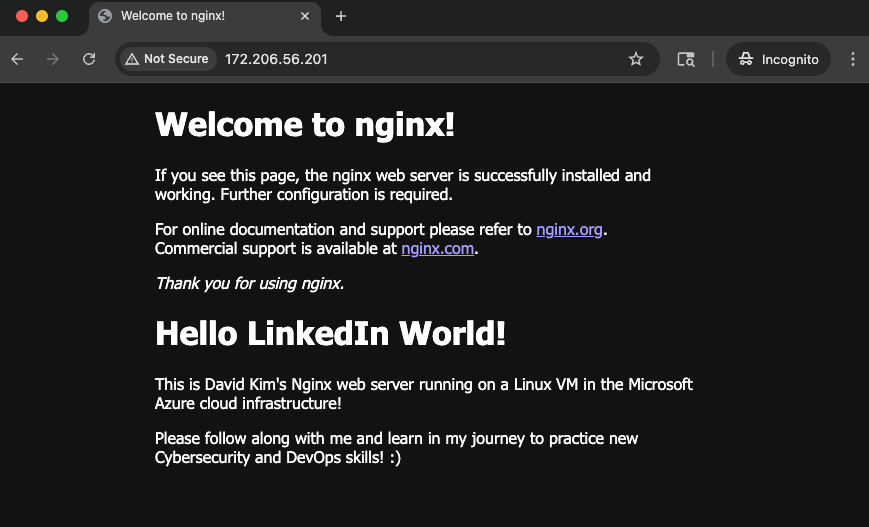

In the field of Cybersecurity and DevOps, there is no substitute for hands-on experience with cloud infrastructure. To further my own practice, I have recently started diving into the **Microsoft Azure ecosystem**. It’s an excellent sandbox for learning with $100 in credits and 750 hours of B1s compute, you have exactly what you need to keep a single VM instance running 24/7 while you experiment.

For this project, I set out to deploy a custom Nginx web server on a Linux VM. Here is a breakdown of the configuration and the logic behind my deployment.

## Infrastructure & The "Front Door"

I began by provisioning a Virtual Machine running **Ubuntu 24.04 LTS**. In the Azure portal, this requires coordinating several moving parts—the VNet, the Public IP, and the storage disk—all housed within a dedicated resource group.

> **Note on Security:** One of the most critical steps was manually configuring the **Network Security Group (NSG)**. Following the principle of least privilege, I restricted ingress traffic to only allow my local machine’s public IP address. I explicitly opened:
>
>
>
> - **Port 22** for SSH management.
> - **Port 80/443** to facilitate standard web traffic.

## Terminal Access & Server Configuration

Once the infrastructure was live, I established a secure connection from my local terminal using an SSH private key. My goal was to transform this blank-slate Ubuntu instance into a functional web server.

After a quick `sudo apt install nginx`, the service was live on the file system. To personalize the landing page, I used `vim` to modify the index file located at `/var/www/html/index.nginx-debian.html`. It was a great way to verify that my changes were being rendered correctly in real-time.

## Verification: "Hello LinkedIn World!"

The final test was hitting the VM’s public IP (`172.206.56.201`) from an incognito browser window. Seeing the custom "Hello LinkedIn World!" message render successfully confirmed that the NSG rules, the virtual network, and the Nginx service were all communicating as intended.

## The Roadmap Ahead

This deployment serves as a foundational step for more complex configurations. My next objectives involve:

- Configuring Nginx as a **Reverse Proxy**.
- Hardening the environment using **Azure VNets** and **Entra ID (IAM)**.
- Transitioning from VM-based installs to **Docker images** and containerization.

I will continue documenting the next phase of my learning journey as I continue to build out my DevOps and cloud security toolkit.
