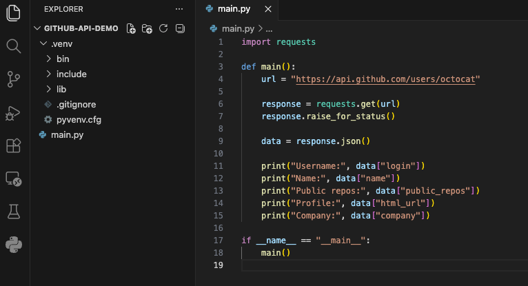
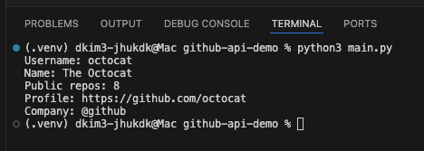

I use Python locally within Visual Studio Code to call a public API. The goal of this exercise is not only to make a successful HTTP request, but also to understand the individual parts of a small Python script that interacts with a real internet service.


A good beginner API for this type of project is the GitHub REST API. This API is useful because it allows new developers to practice with real-world data while learning concepts that commonly appear in professional software development. These concepts include HTTP status codes, JSON responses, environment variables, API tokens, error handling, and storing project dependencies in a local virtual environment.


For a first test, we can call GitHub’s public user endpoint for the well-known `octocat` account. This particular request does not require an API token because it is requesting public information.





Although this script is short, it introduces several important ideas. The `requests.get(url)` line sends an HTTP GET request to the GitHub API. The response from the server is stored in the `response` variable. This response contains the status code, headers, and body returned by the server.


The line `response.raise_for_status()` acts as a safety check. If the API returns a successful status code, such as `200 OK`, the program continues. If the API returns an error code, such as `404 Not Found`, `401 Unauthorized`, or `500 Internal Server Error`, Python raises an exception. This helps prevent the script from continuing as if the API request succeeded when it actually failed.


The line `data = response.json()` converts the JSON response body into a Python object. In this example, GitHub returns information that resembles a dictionary. After the JSON is parsed, individual fields can be accessed with keys such as `data["login"]` or `data["public_repos"]`.





It is also important to avoid uploading local secrets or unnecessary files to a public GitHub repository. A beginner Python project should include a `.gitignore` file in the root of the project folder. This file tells Git which files and folders should remain local.


```
.venv/
.env
__pycache__/
```


The `.venv/` folder should remain on the local machine because it contains the virtual environment. The `.env` file should also remain local because it may contain API keys or tokens. The `__pycache__/` folder is automatically created by Python and does not need to be committed to source control. The `.gitignore` file itself should be committed to the public repository.
