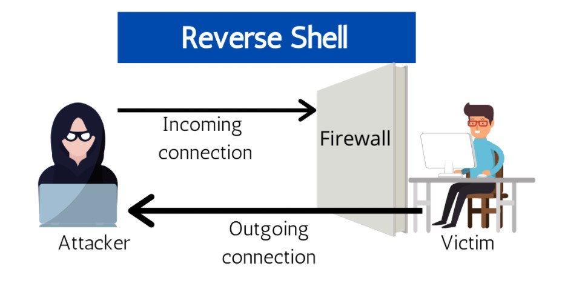

Once a vulnerability is discovered in any given IT system, one common payload a malicious attacker often wants to deliver is a **reverse shell**. From the black-hat attacker's perspective, he or she wants to establish remote command-line access on the server-side of a victim's business network. But what is a "shell?" And why is it considered "reverse?" I will explore these questions in the following brief discussion on the topic.

In the computing world, a "shell" is a generic term for a programmatic means of sending commands to a computer using text and a command line interface (CLI), instead of using a mouse (to point-and-click) and a graphical user interface (GUI). Command Prompt, Windows PowerShell, bash, and zshell are all common examples of computing shells that enable a user (or attacker) to interact with and send commands directly to the operating system layer of a laptop workstation or backend server. For example, launching cmd.exe in a Windows environment or Terminal in MacOS is an example of a user willfully accessing the shell environment.

Firewalls are designed to inspect network packets flowing inbound to (also outbound from) a host, device, server or any other interconnected resource/node within a subnet. The purpose of any firewall is to control network packet flow by either explicitly blocking or allowing digital communications traffic. Firewalls can be implemented at many different logical layers of the OSI model, at different locations in a network topology, in-line as ethernet-wired hardware, or even deployed as endpoint application-based software. For example, Windows Defender is an example of a host-based firewall implemented at the application layer of a corporate workstation.

Firewalls make the process of establishing a reverse shell connection to a victim's device / workstation / web server more difficult, but not impossible. For example, web servers typically are configured to listen for and permit **inbound/ingress** network traffic that makes a request for its resources using port 80 and 443. However, web server firewalls are not always configured to analyze **outbound/egress** network traffic originating from the server with the same fine-toothed comb - meaning the firewall's access control list (ACL) for egress traffic. In this latter case, malicious activity might look like a web server *initiating* the outbound request, instead of exclusively *receiving* and responding to inbound requests. Clearly, this is unusual behavior. Hopefully, logging and event monitoring tools have already been deployed in this fictional environment so that IT administrators can detect suspicious behavior if and when it does occur.

*(Source - https://www.techslang.com/definition/what-is-a-reverse-shell/)*

In the above illustration, an attacker is blocked from making a direct bind-shell connection to the victim's device because the firewall has been configured to deny his incoming attack. Undeterred however, the black-hat criminal decides to take a different method of achieving remote command-line access on the victim's device by utilizing a reverse-shell payload. First, the wily criminal has to figure out a specific vulnerability that exists within the victim's internal LAN. Most any vulnerability will do, whether it is sophisticated by using the latest CVE exploit and technical programming language bug, or much-less sophisticated such as by leveraging phishing or social engineering to get a user to accidentally download malware from a seemingly benign email. Once the reverse-shell malware has been launched within a corporate internal LAN, the malware makes an egress request to an established listening port the attacker has already set up at a remote location. In this manner, the corporate firewall has effectively been bypassed, and the attacker has achieved remote command-line shell access.

After establishing this initial foothold, the attacker can then easily branch out to escalate privileges, establish network persistence, and compromise, modify, and exfiltrate other downstream targets such as proprietary data and/or intellectual property corresponding to the criminal's individual or organizational ultimate objectives. The [MITRE ATT&CK Framework](https://attack.mitre.org/matrices/enterprise/) provides a very helpful methodology that criminals (and red-team penetration testers) often have in mind when attacking information systems, along with detailed descriptions of each step in the process with examples of techniques involved.

Thank you for reading! My writeup was intended to provide very brief context for understanding the severity of a modern 0-day vulnerability like Log4j and its potential downstream impacts.
