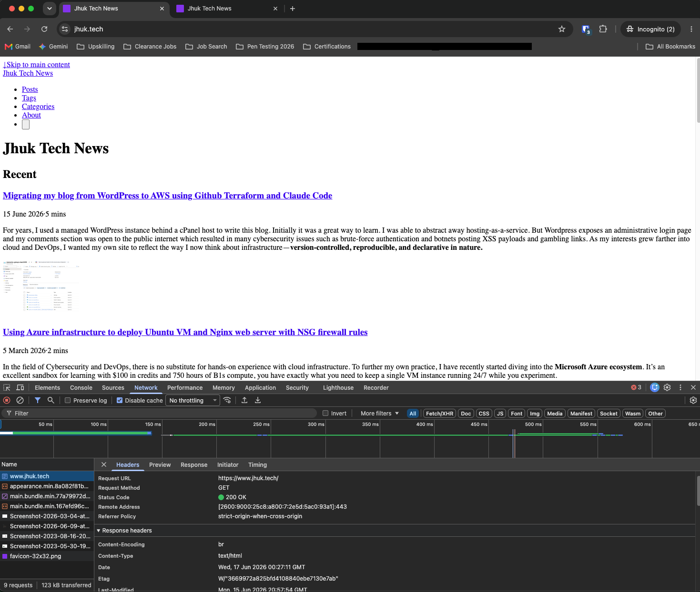

While cleaning up the CloudFront configuration for this blog, I removed a `www.jhuk.tech` → `jhuk.tech` 301 redirect that I assumed was redundant. My reasoning was simple: if both hostnames point at the same CloudFront distribution and the same S3 bucket, then both should serve the same site. Why force a redirect at all?

After deploying the change, I noticed something strange. The apex domain `https://jhuk.tech` rendered perfectly, but `https://www.jhuk.tech` returned the same page as a wall of unstyled HTML — no theme, no layout, no JavaScript. Two URLs, the same bytes on the server, two completely different experiences in the browser. This post is a breakdown of why that happened and the tradeoffs I weighed before settling on a fix.



## The Pages Were Identical — the Browser Was Not

The first instinct is to assume `www` is serving different content. It wasn't. Fetching both URLs returned a byte-for-byte identical HTML document — same `Content-Length`, same title, same markup. The server was doing its job correctly. The difference was entirely client-side, and the clue was in how the assets are referenced:

```html
<link rel="stylesheet"
      href="https://jhuk.tech/css/main.bundle.min.<hash>.css"
      integrity="sha256-...">
<script src="https://jhuk.tech/js/main.bundle.min.<hash>.js"
        integrity="sha256-..."></script>
```

Two details in those tags, both Hugo/Congo defaults, combine to cause the problem.

## Default #1: Hugo Emits Absolute Asset URLs

Hugo builds a site against a single `baseURL` — in my case `https://jhuk.tech/`. Every fingerprinted asset (the bundled CSS and JS) is emitted as an **absolute apex URL**, not a relative path. So when the browser loads the page from `https://www.jhuk.tech/`, the HTML tells it to go fetch the stylesheet and script from `https://jhuk.tech/`. That is a **cross-origin** request: `www.jhuk.tech` and `jhuk.tech` are different origins as far as the browser is concerned.

On its own, a cross-origin stylesheet or script is fine — browsers load those every day. The breakage comes from the second default.

## Default #2: Congo Adds Subresource Integrity (SRI)

Congo, the Hugo theme this blog uses, ships those asset tags with a Subresource Integrity hash — the `integrity="sha256-..."` attribute. SRI is a security feature: the browser refuses to apply a stylesheet or execute a script unless its bytes match the hash baked into the HTML. It is excellent protection against a tampered or swapped asset.

But SRI has a strict rule for **cross-origin** resources. To verify the hash, the browser must fetch the resource in **CORS mode**. A `<link>` or `<script>` only enters CORS mode if it carries a `crossorigin` attribute — and the Congo-generated tags do not have one. So the sequence on `www.jhuk.tech` is:

1. The browser requests the CSS/JS from `jhuk.tech` in *no-cors* mode (no `crossorigin` attribute).
2. It receives an **opaque** response it is not allowed to read.
3. SRI cannot verify an opaque response, so the integrity check fails.
4. The browser **blocks** the stylesheet and the script.

The result: raw, unstyled HTML. Meanwhile the apex domain serves the assets *same-origin*, SRI passes, and the page renders perfectly. The two Hugo/Congo defaults — absolute URLs plus SRI without `crossorigin` — are individually reasonable but together they guarantee that a single-`baseURL` site can only render cleanly from the one host it was built for.

A key takeaway: **CORS headers alone would not have fixed this.** Adding `Access-Control-Allow-Origin` to the asset responses is necessary but not sufficient, because the tags also lack the `crossorigin` attribute needed to put the request into CORS mode in the first place. A real CORS-based fix requires *two* coordinated changes — the response header on CloudFront **and** a theme override to add `crossorigin="anonymous"` to every asset tag.

## The Option I Considered: Turning Off SRI

If SRI is what blocks the cross-origin assets, then disabling it would let them load. Without an `integrity` attribute, a normal cross-origin stylesheet or script loads with no CORS handshake required at all — CORS only became necessary *because* of SRI. One configuration change instead of two. It was tempting.

I talked myself out of it. Disabling SRI is a **site-wide security downgrade**, and I would have been making it to support `www` — a hostname I do not actually need to serve independently. The things SRI protects against:

- A tampered or swapped asset if the S3 bucket, CloudFront distribution, or deploy pipeline were ever compromised. On a blog, a malicious replacement of `main.bundle.js` is effectively stored XSS.
- Defense-in-depth against a bad or poisoned deploy serving modified content.
- A building block for a stricter Content-Security-Policy later.

The residual risk of disabling it *is* lower on a first-party, HTTPS-only static site — TLS already covers in-transit tampering, the assets live in my own bucket rather than a third-party CDN, and an attacker who can rewrite my bundles can probably rewrite the HTML too. But "acceptable" is not "good." I would be weakening the security posture of the **canonical, real site** (the apex) purely to prop up a duplicate. That is a bad trade.

There was also a deeper problem that no asset fix would solve. The HTML served under `www` still hardcodes `<link rel="canonical" href="https://jhuk.tech/">` and `og:url` pointing at the apex. Even if I made `www` render perfectly, it would remain a **non-canonical duplicate** — search engines are explicitly told the real page lives at the apex. Serving two hostnames was creating an SEO duplicate-content situation on top of the rendering bug.

## The Tradeoff I Settled On: a 301 Redirect

The cleanest fix turned out to be the thing I had removed. A `www.jhuk.tech` → `https://jhuk.tech` **301 redirect** at the CloudFront edge solves every layer of the problem at once:

- **Rendering:** every visitor lands on the apex, where assets are same-origin and SRI passes. The page renders correctly, every time.
- **Security:** SRI stays on across the entire site. No downgrade.
- **SEO:** there is exactly one canonical host. No duplicate content.
- **Simplicity:** one redirect rule, versus a CORS response-header policy *plus* a theme-partial override to inject `crossorigin`.

The redirect was not legacy cruft I had failed to clean up — it was load-bearing. A static site built against a single `baseURL` is *designed* to be served from one canonical host, and a host-level redirect is the idiomatic way to enforce that. Removing it did not give me "`www` serves the site"; it gave me "`www` serves a broken copy."

## Lessons

- **Identical server responses can render differently** when assets are absolute and cross-origin. The server being "correct" does not mean the page works.
- **Framework defaults encode assumptions.** Hugo assumes a single `baseURL`; Congo assumes same-origin assets when it adds SRI. Both are sound defaults — until you serve a second hostname and quietly violate the assumption.
- **SRI and cross-origin assets require `crossorigin`, not just CORS headers.** A response header alone never gets exercised if the request was never made in CORS mode.
- **Pick the fix that solves the most layers.** Disabling SRI fixed rendering but cost security and left the SEO problem. The redirect fixed rendering, security, and SEO together — and was the smallest change. That made it the clear winner.
